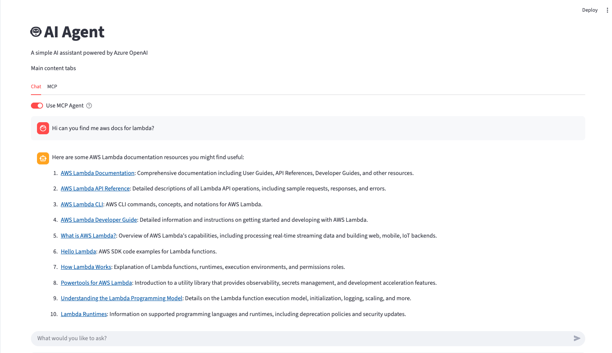

# langchain-agent-with-mcp-streamlit-ui

An Azure OpenAI powered Streamlit app with optional MCP agent tools. It supports:

- Chatting with an LLM (Azure OpenAI)
- Using an MCP-backed agent to invoke tools defined in `mcp.json`
- Viewing and verifying MCP server configuration and health
- Detailed usage logging and simple cost tracking



### Requirements

- Python 3.10+
- Azure OpenAI access and deployment
- MCP HTTP servers (optional, for agent tools)

Install Python dependencies:

```bash
pip install -r requirements.txt
```

### Configuration

The app reads environment variables from `config.env` (or `.env`, `config.txt`) if present.

Required for Azure OpenAI:

- `AZURE_OPENAI_API_KEY`
- `AZURE_OPENAI_ENDPOINT`

Optional:

- `LOG_LEVEL` (default: INFO)
- `ENABLE_CONVERSATION_LOG` (default: true)
- `ENABLE_DETAILED_LOGGING` (default: true)
- `STREAMING_DELAY` (default: 0.02s)
- `MCP_CONFIG_PATH` (path to `mcp.json`; defaults to `steamlit-app/mcp.json` or repo root)
- `SYSTEM_PROMPT_PATH` (path to a system prompt file; defaults to `steamlit-app/system_prompt.md`)

### MCP configuration (tools)

The app loads MCP servers only from `mcp.json`. For streamable HTTP MCP servers, use `transport: "streamable_http"`.

Example `mcp.json`:

```json
{
  "mcpServers": {
    "aws-news": {
      "url": "http://127.0.0.1:8000/mcp",
      "transport": "streamable_http"
    }
  }
}
```

Notes:
- The MCP servers must be started separately.
- Local health checks are displayed for `http://127.0.0.1:<port>/health` URLs.


Refer to the LangChain MCP adapters documentation for supported transports and examples: [langchain-mcp-adapters](https://github.com/langchain-ai/langchain-mcp-adapters).

### System prompt

The agent’s system prompt is loaded from `system_prompt.md` (or `SYSTEM_PROMPT_PATH`).

Default file: `steamlit-app/system_prompt.md`.

### Running the app

From this directory (or repo root), run:

```bash
streamlit run app.py
```

### Using the app

1. Open the app in your browser (Streamlit will print the URL).
2. In the Chat tab, use the toggle “Use MCP Agent” to switch between:
   - Direct LLM responses (no tools)
   - MCP Agent responses (tools loaded from `mcp.json`, with external system prompt)
3. In the MCP tab:
   - Inspect the loaded `mcp.json` and per-server details
   - View the generated client configuration
   - Click “List MCP tools (all servers)” or “List tools per server” to verify tool discovery

### Troubleshooting

- Unsupported transport: http
  - Ensure your `mcp.json` uses `"transport": "streamable_http"` for HTTP MCP servers.
  - This is the transport expected by the adapters for streamable HTTP.

- No MCP servers configured
  - Provide a valid `mcp.json` (set `MCP_CONFIG_PATH` if not colocated with `app.py`).

- No tools available in agent
  - Make sure the MCP servers are running and reachable from the machine running the app.
  - Confirm tool endpoints are decorated and exposed by your server.

- Azure OpenAI errors
  - Verify `AZURE_OPENAI_API_KEY`, `AZURE_OPENAI_ENDPOINT`, and your deployment name in `model_configs.json`.

### Logs and usage

- App logs: `ai_agent.log`
- Conversation logs (if enabled): `conversation_log.json`

### Architecture overview

- UI: Streamlit (`app.py`)
- LLM: Azure OpenAI via `langchain-openai`
- Agent (optional): LangChain `create_agent`, tools loaded via `langchain-mcp-adapters` from `mcp.json`
- MCP: Streamable HTTP MCP servers (e.g., FastMCP) started separately


